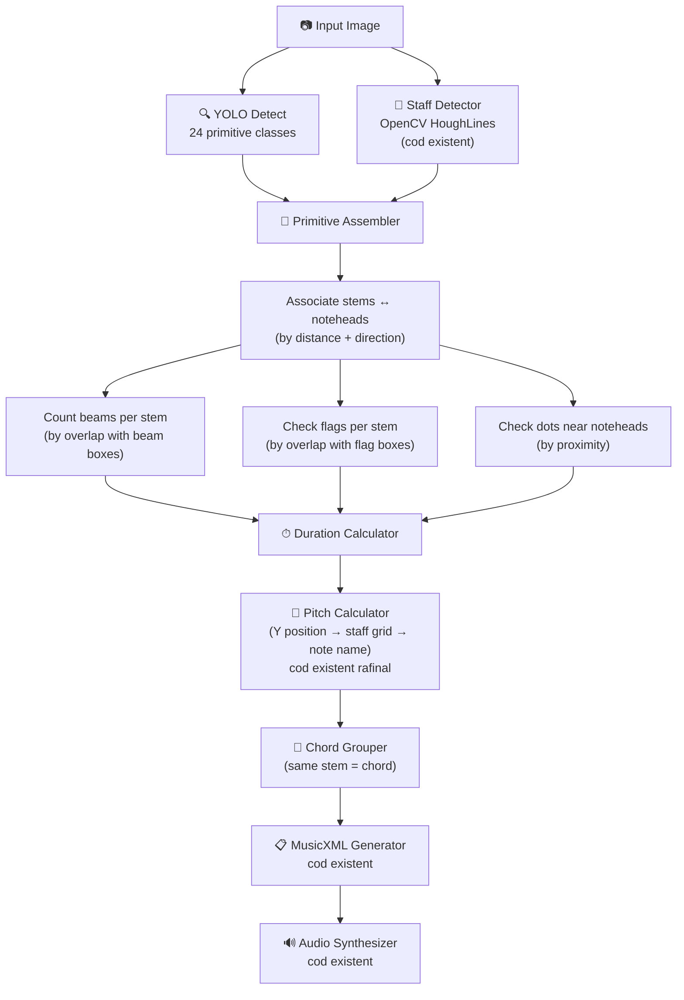

# Plan: Antrenare Model Nou YOLO pe Primitive Muzicale

## Contextul Problemei

Modelul actual YOLOv8s (15 clase monolitice, 5 imagini de antrenare) eșuează pe partituri complexe:
- Confundă duratele (quarter vs eighth vs sixteenth)
- Detectează note "fantomă" sau sare peste note reale
- NMS-ul șterge note din acorduri dense

Soluția: re-antrenare pe **DeepScores v2** cu **clase primitive** (piese de lego muzicale) și logică de asamblare post-detecție.

---

## 1. Datasetul: DeepScores v2 — Dense Version

| Proprietate | Valoare |
|---|---|
| **Sursă** | [Zenodo — DOI 10.5281/zenodo.4012193](https://zenodo.org/records/4012193) |
| **Fișier** | `ds2_dense.tar.gz` |
| **Dimensiune** | **742 MB** |
| **Imagini** | **1,714** (cele mai diverse și interesante pagini) |
| **Instanțe totale** | ~400,000+ adnotări pe cele 1,714 imagini |
| **Format adnotări** | JSON custom (similar COCO). Include bbox non-orientate + OBB |
| **Clase disponibile** | 135 |
| **Metadata extra** | Include pitch (linia pe portativ) și onset beat pentru noteheads |

> [!TIP]
> Versiunea "dense" (742MB) este suficientă — este un subset curated cu diversitate maximă. Versiunea completă (80GB) ar necesita zile de descărcare și antrenament mult mai lung fără beneficii proporționale.

---

## 2. Lista de Clase Propusă — 24 Clase (acoperire ≥99%)

Am analizat frecvența simbolurilor muzicale în partituri standard. Iată cele 24 de clase care acoperă practic tot ce apare în partiturile clasice, pop, jazz, și românești:

### Tier 1 — Esențiale (prezente în 100% din partituri)

| # | Clasă DeepScores v2 | Descriere | De ce e necesară |
|---|---|---|---|
| 0 | `noteheadBlack` | Cap de notă plin (solid) | Quarter, Eighth, 16th, 32nd — baza oricărei note cu durată ≤ pătrime |
| 1 | `noteheadHalf` | Cap de notă gol (hollow) | Half note, Whole note |
| 2 | `noteheadWhole` | Cap de notă întreagă (oval mare, fără tijă) | Whole note — formă distinctă de half |
| 3 | `stem` | Tija verticală | Conectează noteheadul de beams/flags |
| 4 | `beam` | Baretă (conectează tije) | Grupare ritmică: 1 beam = 8th, 2 = 16th, 3 = 32nd |
| 5 | `flag8thUp` | Steguleț de optimă (sus) | Notă izolată de eighth |
| 6 | `flag8thDown` | Steguleț de optimă (jos) | Idem, tija în jos |
| 7 | `flag16thUp` | Steguleț 16th (sus) | Notă izolată de șaisprezecime |
| 8 | `flag16thDown` | Steguleț 16th (jos) | Idem |
| 9 | `augmentationDot` | Punct de prelungire | Notă punctată (+50% durată) |
| 10 | `clefG` | Cheia Sol | Definitoriu pentru pitch |
| 11 | `clefF` | Cheia Fa | Partituri de pian (mâna stângă) |
| 12 | `accidentalSharp` | Diez (#) | Alterează pitch cu +1 semiton |
| 13 | `accidentalFlat` | Bemol (♭) | Alterează pitch cu -1 semiton |
| 14 | `accidentalNatural` | Becar (♮) | Anulează diez/bemol anterior |

### Tier 2 — Importante (prezente în ~95% din partituri)

| # | Clasă DeepScores v2 | Descriere | De ce e necesară |
|---|---|---|---|
| 15 | `restWhole` | Pauză de notă întreagă | |
| 16 | `restHalf` | Pauză de doime | |
| 17 | `restQuarter` | Pauză de pătrime | |
| 18 | `restEighth` | Pauză de optimă | |
| 19 | `rest16th` | Pauză de șaisprezecime | |
| 20 | `barline` | Linie de bară (separator măsuri) | Critică pentru structura ritmică |
| 21 | `barlineFinal` | Linie de bară finală (groasă) | Marchează sfârșitul piesei |

### Tier 3 — Utile (prezente în ~70-90% din partituri)

| # | Clasă DeepScores v2 | Descriere | De ce e necesară |
|---|---|---|---|
| 22 | `keyFlat` | Bemol din armura de cheie | Key signature — definitoriu global |
| 23 | `keySharp` | Diez din armura de cheie | Key signature |

### De ce 24 și nu 18?

Lista ta inițială de 18 era pe drumul bun, dar lipseau câteva elemente critice:

1. **`noteheadWhole`** — forma sa e distinctă de `noteheadHalf` (nu are tijă deloc, e mai mare și perfect ovală). YOLO trebuie să le distingă
2. **`flag16thUp/Down`** — fără ele, nu poți diferenția o optime izolată de o șaisprezecime izolată (ambele au stegulețe, dar diferit!)  
3. **`accidentalNatural`** — fără becar, pitch-ul e greșit în orice piesă cu armură de cheie
4. **`keyFlat` / `keySharp`** — armura de la început definește tonalitatea piesei; fără ea, jumătate din note vor avea pitch-ul greșit
5. **`barlineFinal`** — marchează sfârșitul secțiunii/piesei
6. **`rest16th`** — omisiune critică dacă procesezi partituri rapide

### Ce am exclus deliberat (și de ce)

| Simbol | De ce e exclus |
|---|---|
| `tie`, `slur` | Forme extrem de variabile (curbe lungi). Foarte greu de detectat cu bbox standard. Se pot adăuga mai târziu |
| `tupletBracket` (trioleuri) | Rare (<5% din partituri). Adaugă complexitate logică mare |
| `dynamicF`, `dynamicP` etc. | Nu afectează pitch-ul sau ritmul — sunt informații de expresie |
| `flag32ndUp/Down` | Extrem de rare. Dacă apar, le poți aproxima ca 16th |
| `timeSig0`–`timeSig9` | Time signatures (4/4, 3/4 etc.). Utile, dar pot fi adăugate post-MVP |
| `clefC` | Cheia Do (Alto/Tenor). Apare doar în partituri de orchestră, rar |
| `ledgerLine` | Linii adăugătoare. Staff detector-ul tău existent le gestionează geometric |

---

## 3. Estimare Antrenare — RTX 4060

| Parametru | Valoare |
|---|---|
| Model | **YOLOv8s** (small — optimal pentru 8GB VRAM) |
| `imgsz` | **1280** |
| `batch` | **4** (maxim pe 8GB cu 24 clase la 1280px) |
| `epochs` | **100** |
| Timp per epoch | **~12–16 min** (1714 imagini, ~400K instanțe) |
| **Timp total** | **~20–28 ore** ✅ Sub 48h |
| Augmentări | Default YOLO (mosaic, flip, hsv, scale) |

> [!WARNING]
> Dacă ai probleme de VRAM la `batch=4`, scade la `batch=2`. Timpul crește la ~35–45h dar tot intri în 48h.

> [!TIP]
> **YOLOv8s vs YOLOv8m**: Cu doar 1714 imagini, s va generaliza mai bine decât m (care ar face overfit). Rămâi la YOLOv8s.

---

## 4. Arhitectura Pipeline-ului Nou



### Reguli de Asamblare Durată

```
noteheadBlack + stem + 0 beams + 0 flags = Quarter (1 beat)
noteheadBlack + stem + 1 beam             = Eighth (0.5 beats)
noteheadBlack + stem + 2 beams            = 16th (0.25 beats)
noteheadBlack + stem + 3 beams            = 32nd (0.125 beats)
noteheadBlack + stem + flag8th            = Eighth izolat
noteheadBlack + stem + flag16th           = 16th izolat
noteheadHalf  + stem                      = Half (2 beats)
noteheadWhole (fără stem)                 = Whole (4 beats)
Orice notă    + augmentationDot           = durată × 1.5
```

---

## 5. Calendar — 7 Zile

| Zi | Activitate Principală | GPU | Detalii |
|---|---|---|---|
| **Zi 1** | Dataset: descărcare + conversie format | Liber | Descarci `ds2_dense` (742MB), scrii script conversie JSON → YOLO txt, filtrezi la 24 clase, sanity check |
| **Zi 2** | Lansezi antrenarea + Începi assembler | **Antrenare** (~20-28h) | Dimineața dai `yolo train`. Restul zilei scrii `associate_stems_to_noteheads()` |
| **Zi 3** | Assembler: beams + flags + dots | **Antrenare** (continuă) | `count_beams_on_stem()`, `detect_flags()`, `associate_dots()`, `calculate_duration()` |
| **Zi 4** | Assembler: chord grouping + barlines | Antrenarea termină | `group_chords_by_shared_stem()`, `split_by_barlines()` |
| **Zi 5** | Integrare pipeline | Inferență test | Conectezi noul model + assembler la pipeline-ul existent |
| **Zi 6** | Debug + test pe 10+ partituri | Inferență | Fix pitch, durată, acorduri. Ajustezi praguri |
| **Zi 7** | Polish + benchmark + documentare | Inferență | A/B vs Oemer, UI update, README, cleanup |

---

## 6. Structura de Fișiere Nouă

```
models/
├── yolov8s_primitives_24cls.pt        ← [NOU] Modelul antrenat
├── yolov8s_15clase_1280px.pt          ← [EXISTENT] Modelul vechi (backup)
└── custom_yolo_inference.py           ← [MODIFICAT] Pipeline nou cu assembler

core/
├── primitive_assembler.py             ← [NOU] Logica stem↔notehead↔beam→durată
├── staff_detector.py                  ← [EXISTENT] Fără modificări
├── beam_detector.py                   ← [EXISTENT] Posibil de eliminat (YOLO detectează beams direct)
├── image_processing.py                ← [EXISTENT] Oemer baseline
└── audio_synthesis.py                 ← [EXISTENT] Fără modificări

training/
├── ds2_to_yolo.py                     ← [NOU] Script conversie DeepScores → YOLO format
├── data.yaml                          ← [NOU] Config YOLO (24 clase)
└── train_config.py                    ← [NOU] Script pentru lansare antrenare
```

---

## Open Questions

> [!IMPORTANT]
> **Q1: Flags direcționale** — DeepScores v2 separă `flag8thUp` de `flag8thDown`. Vrei să le păstrăm separate (24 clase) sau să le combinăm în `flag8th` + `flag16th` (22 clase)? Separarea dă informație despre direcția tijei, dar combinate simplifică antrenarea.

> [!IMPORTANT]
> **Q2: `noteheadWhole` separat?** — În unele fonturi muzicale, whole noteheads arată identic cu half noteheads. Merită clasă separată, sau le combinăm în `noteheadEmpty` și determinăm whole vs half prin prezența/absența stem-ului?

> [!IMPORTANT]
> **Q3: Dataset augmentation** — Vrei doar augmentările default YOLO, sau adăugăm augmentări custom (rotație ±3°, simulare scanare low-quality, inversoare alb/negru)?

> [!WARNING]
> **Q4: Key signatures** — Am inclus `keyFlat`/`keySharp` (clasele 22-23). Acestea sunt bemoii/diezii de la ÎNCEPUT (armura de cheie). Dacă nu le detectăm, orice piesă în Si bemol major va avea pitch-ul greșit pe toate notele Si, Mi, La. Dar adaugă complexitate la logica post-detecție (trebuie un modul de "context muzical"). Vrei să le includem acum sau le lăsăm pentru o versiune viitoare?

---

## Verification Plan

### Antrenare
- mAP50 țintă: **≥ 0.75** pe validation set
- mAP50-95 țintă: **≥ 0.50**
- Vizualizare confusion matrix: verificăm dacă noteheadBlack/Half se confundă

### Pipeline End-to-End
1. **Twinkle Twinkle** (simplu) — trebuie să returneze notele corecte, identic cu Oemer
2. **Für Elise - intro** (mediu) — treceturi rapide + acord-uri simple  
3. **Unravel / piesă complexă** (greu) — acorduri dense, ritmuri mixte
4. **Comparație directă** cu modelul vechi (15 clase) pe aceleași partituri
